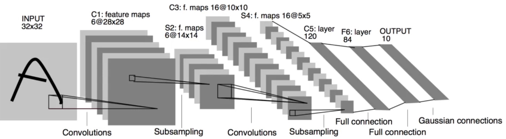
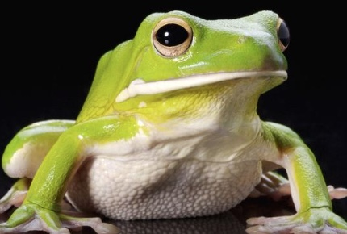

# LeNet_Pytorch
This is just a part of my computer vision world.

The training results of 32 * 32 pixels have a good recognition effect on cars, frogs and aircraft with obvious features.

However, for objects with fuzzy boundaries such as birds, dogs and cats, the false recognition rate is low.

 

**That is, the detailed texture feature parameters are insufficient and can only be recognized by fuzzy contour.
The main reason is that the training and input of the network is limited to 32 x 32 pixels, and the detailed information
is lost, which is not enough to support more detailed category judgment.**

For traditional computer image processing, this method still has strong guiding significance in the 1990s.