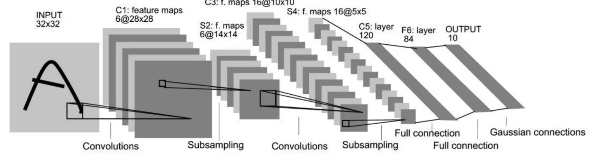
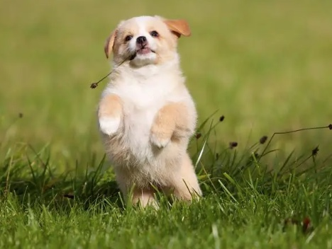

# LeNet_Pytorch

32*32像素的训练结果，对于特征较为明显的车、青蛙、飞机具有较好的识别作用。

但对于鸟、狗、猫这类的具有模糊边界的物体识别，误识别率较低。

 

**即细节纹理特征参数不足，仅能通过模糊的轮廓进行识别。
主要原因则是网络的训练与输入限制为32 x 32像素，丢失了细节信息， 不足以支撑更加详细的类别判断。**

对于传统的计算机图像处理而言，这种方法在20世纪90年代，仍具有相当强的指导意义。
s